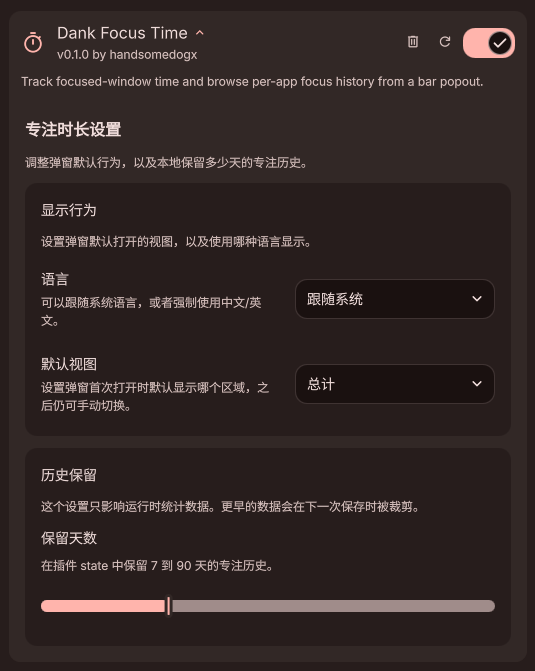
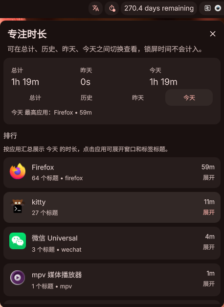

# Dank Focus Time

`dankFocusTime` is a DMS widget plugin that tracks how long each focused window title stays active and lets you review retained daily history.

<p align="center">
  
  
</p>

## What It Does

- keeps a daily leaderboard of focused window titles
- excludes locked time from accumulation
- stores a configurable 7 to 90 days of history in plugin state
- shows a timer icon in DankBar and opens a popout with per-app totals that expand into window and tab title details
- lets the popout switch between overall, history, yesterday, and today views
- adds a dedicated history browser for retained daily views
- includes a settings page for language, default view, and retention days
- localizes popout text for English and Chinese based on the current system locale

## Important Behavior

This is a single `widget` plugin, not a daemon.
That means it only collects data while at least one instance of the widget is present in an active DankBar.

To avoid double-counting on multi-monitor setups, the widget elects one live instance as the collector and the other instances stay read-only.

## Files

- `plugin.json`: plugin manifest
- `DankFocusTimeWidget.qml`: widget UI, collector lease logic, and state persistence
- `DankFocusTimeSettings.qml`: plugin settings UI for defaults and retention
- `TimeUtils.js`: small helpers for day-splitting, retention pruning, and duration formatting

## Install

If the repository is already symlinked into your DMS plugin directory, just make sure `dankFocusTime` is added to one of your bar widget sections.

Typical local path:

```text
~/.config/DankMaterialShell/plugins/dankFocusTime -> /home/handsomedog/Project/dankFocusTime
```

## Validation

Recommended local checks after editing:

```bash
jq . plugin.json
dms ipc call plugins reload dankFocusTime
dms ipc call plugins status dankFocusTime
```

If DMS is not currently running, IPC reload and status will fail until the shell is started again.
